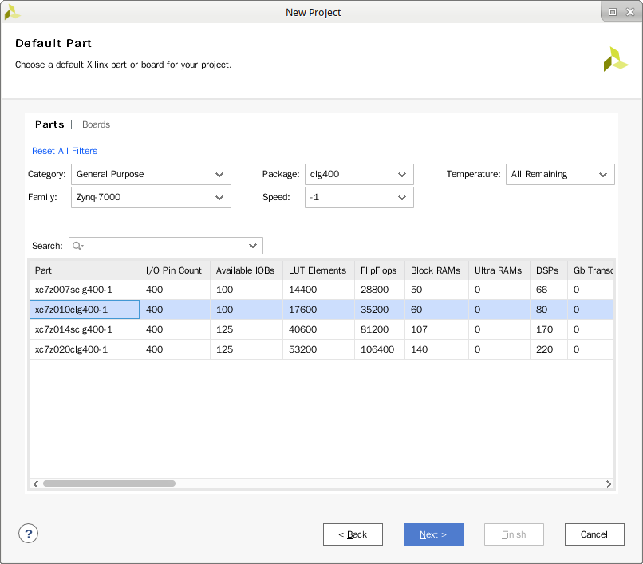
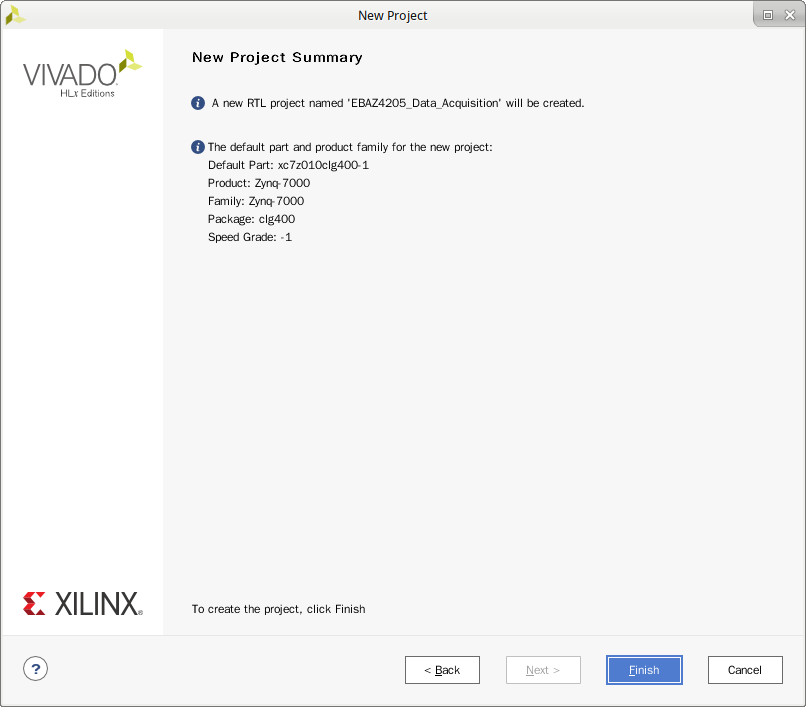
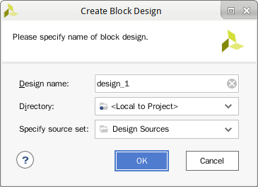
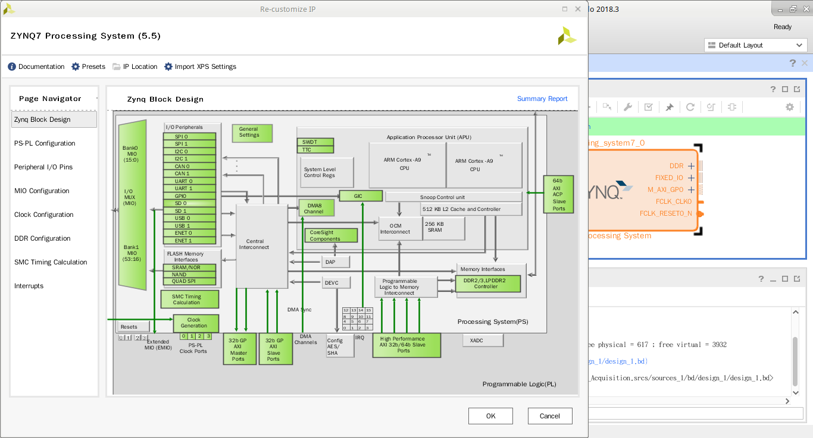
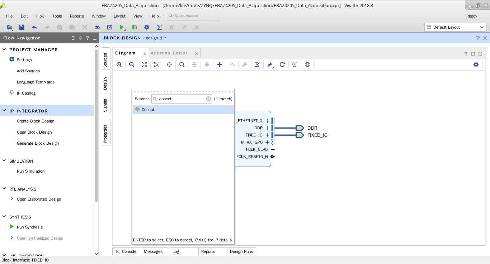
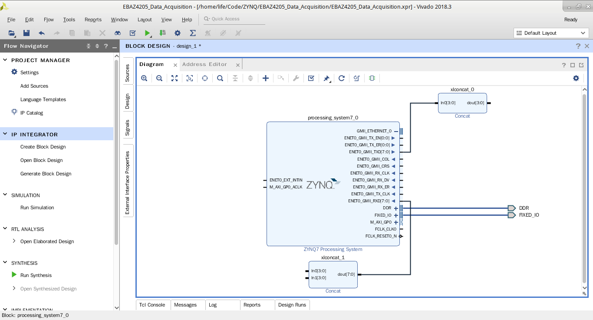
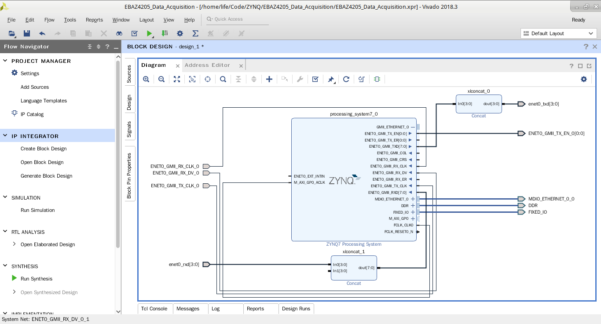
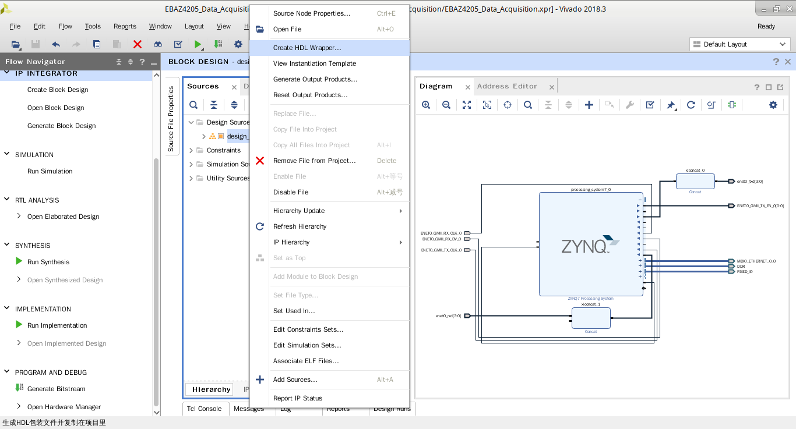
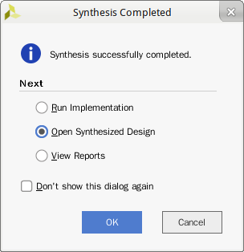

###创建工程

首先打开vivado，点击"New Project"，弹出新建工程对话框，选择"RTL Project" 并钩上 "Do not specify sources at this time"。

然后Next到选择器件，选择 "xc7z010clg400-1"芯片。

然后Next会显示新建工程概要。

然后点击"Finish"完成创建工程。

###添加IP
在左侧找到 "Create Block Design" 选项。

然后点击"Create Block Design"选项后会弹出“Create Block Design” 对话框。

然后点击OK后会显示Block Diagram。然后点击“+”添加ZYNQ PS IP。

然后在弹出的IP选择框里填入ZYNQ，点击 "ZYNQ7 Processing System" 完成添加。

###配置IP
双击 Diagram 里面出现的那个 "ZYNQ7 Processing System" 然后弹出PS部分配置界面。

首先配置NAND Flash 控制器，虽然一直没有用到。

然后配置ENET0, SD0 和 UART 1.注意MIO引脚配置。

然后配置时钟，注意ENET0改成100Mbps。

然后配置DDR，采用 MT41K128M16 的配置。


###分配IO
由于PS端的ENET0是通过EMIO接口引出，所以需要手动指定IO。
并且ENET0是GMII接口，TX和RX是八位的，而板子上的IP101GA是MII接口TX和RX是4位的，所以需要增加两个concat模块来将八位的TX和RX转换成四位的。

加好Concat之后是这样

然后在要用到的引脚上面右键，然后在右键菜单里选择“Make External”导出引脚，最后完成了是这样

然后在左侧点击 “Generate Block Design”，然后在中间的“Source” 栏中选择 "designe 1"，然后右键菜单中选择 "Create HDL Wapper"。

然后在左侧点击 "Run synthesis"。完成之后弹出的对话框选择"Open Synthesized Design"。

然后在Sources里面新建一份约束文件，双击打开新建的约束文件，将下列内容复制进去并保存
```
set_property IOSTANDARD LVCMOS33 [get_ports {enet_rxd[3]}]
set_property IOSTANDARD LVCMOS33 [get_ports {enet_rxd[2]}]
set_property IOSTANDARD LVCMOS33 [get_ports {enet_rxd[1]}]
set_property IOSTANDARD LVCMOS33 [get_ports {enet_rxd[0]}]
set_property IOSTANDARD LVCMOS33 [get_ports ENET0_GMII_RX_DV_0]
set_property IOSTANDARD LVCMOS33 [get_ports MDIO_ETHERNET_0_0_mdio_io]
set_property IOSTANDARD LVCMOS33 [get_ports MDIO_ETHERNET_0_0_mdc]
set_property IOSTANDARD LVCMOS33 [get_ports ENET0_GMII_RX_CLK_0]
set_property IOSTANDARD LVCMOS33 [get_ports ENET0_GMII_TX_CLK_0]
set_property IOSTANDARD LVCMOS33 [get_ports {enet_txd[3]}]
set_property IOSTANDARD LVCMOS33 [get_ports {enet_txd[2]}]
set_property IOSTANDARD LVCMOS33 [get_ports {enet_txd[1]}]
set_property IOSTANDARD LVCMOS33 [get_ports {enet_txd[0]}]
set_property IOSTANDARD LVCMOS33 [get_ports {ENET0_GMII_TX_EN_0[0]}]

set_property PACKAGE_PIN Y16 [get_ports {enet_rxd[0]}]
set_property PACKAGE_PIN V16 [get_ports {enet_rxd[1]}]
set_property PACKAGE_PIN V17 [get_ports {enet_rxd[2]}]
set_property PACKAGE_PIN Y17 [get_ports {enet_rxd[3]}]
set_property PACKAGE_PIN W18 [get_ports {enet_txd[0]}]
set_property PACKAGE_PIN Y18 [get_ports {enet_txd[1]}]
set_property PACKAGE_PIN V18 [get_ports {enet_txd[2]}]
set_property PACKAGE_PIN Y19 [get_ports {enet_txd[3]}]
set_property PACKAGE_PIN W16 [get_ports ENET0_GMII_RX_DV_0]
set_property PACKAGE_PIN W15 [get_ports MDIO_ETHERNET_0_0_mdc]
set_property PACKAGE_PIN Y14 [get_ports MDIO_ETHERNET_0_0_mdio_io]
set_property PACKAGE_PIN U14 [get_ports ENET0_GMII_RX_CLK_0]
set_property PACKAGE_PIN U15 [get_ports ENET0_GMII_TX_CLK_0]
set_property PACKAGE_PIN W19 [get_ports {ENET0_GMII_TX_EN_0[0]}]
```
然后在左侧点击 "Run synthesis"，完成之后继续“Run Implementation”，完成之后继续“Generate Bitstream”。
完成之后 File->Export->Export HardWare，记得勾上Include Bitstream。
