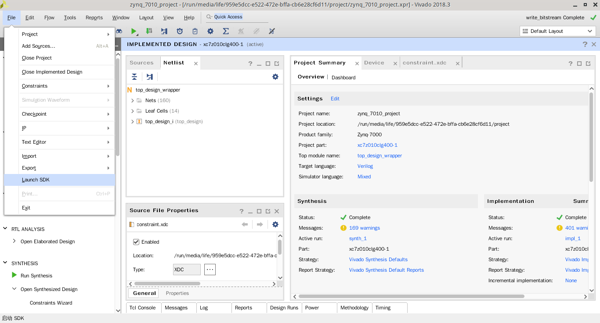
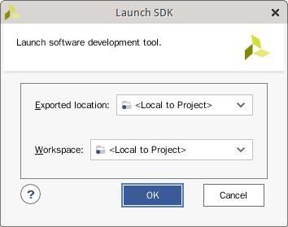
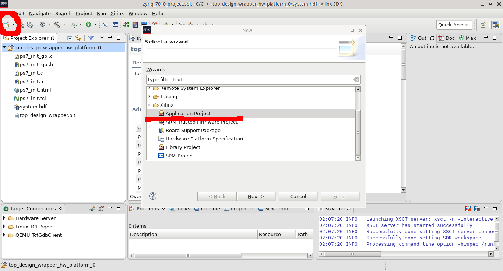
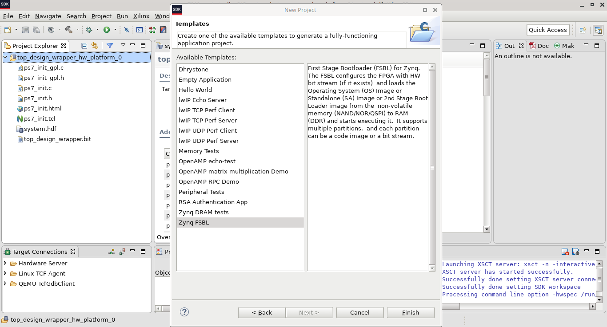
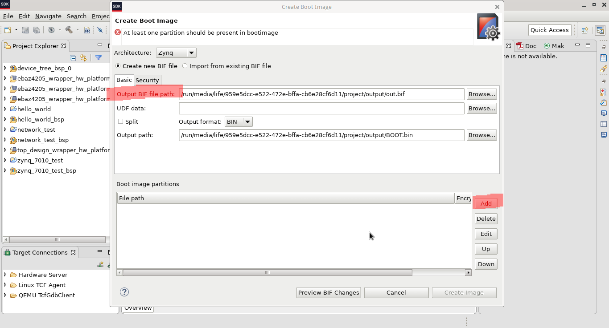
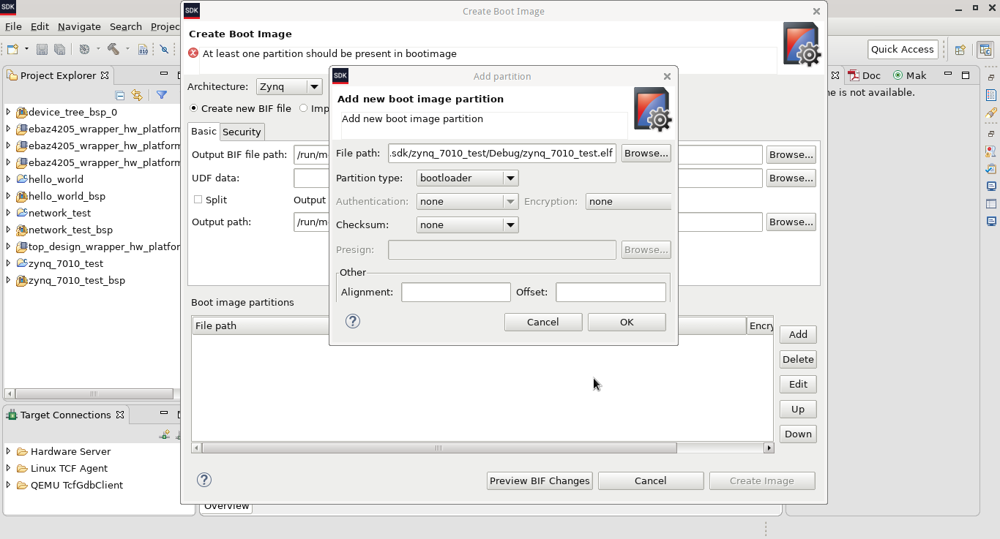
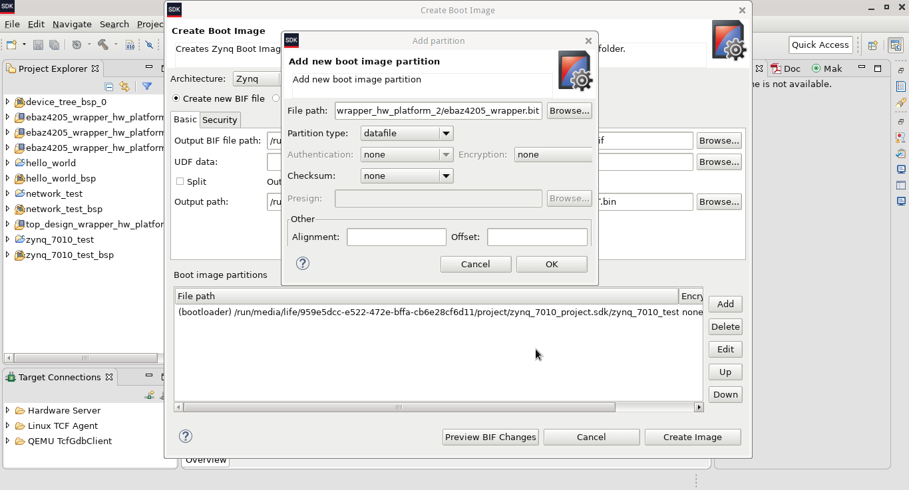
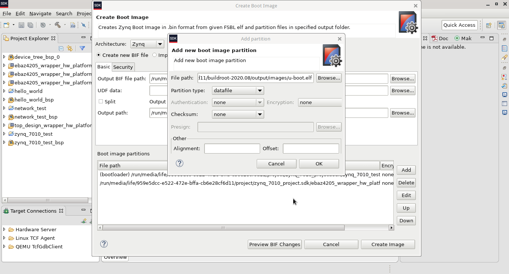

首先启动Xilinx SDK

启动过程中会弹出对话框，点OK即可

然后新建一个FSBL工程，点击SDK主界面左上角的新建工程图标

然后弹出新建工程对话框，在对话框中选择 **Application Project**，然后点击 Next 按钮会继续到模板选择对话框。
 在这里选择最后一个 **Zynq FSBL** 模板。然后点击 Finish 按钮 SDK 会自动编译刚才选择的模板程序。

现在bootloader程序已经准备好了，还需要一个应用程序。同样的，在主界面点击新建工程图标，然后选择 **Application Project** 然后接下来的模板选择界面可以选择一个Hello World 模板，然后点击 Finish。这样就生成了一个 Hello World 应用程序。

最后需要将前面生成的bitstream，FSBL和Hello World 整合到一起去生成启动文件。在 SDK 的菜单栏中选择 Xilinx -> Create Boot Image

首先填入 __Output BIF File Path__，然后点击 __Add__ 按钮添加文件。

首先添加FSBL。

然后添加Bitstream。

最后添加应用程序，应用程序可以是前面创建的Hello World，也可以是uboot。注意应用程序一定要以elf结尾，像uboot默认编译出来的可执行文件没有后缀，一定要给它加上.elf的后缀。

点击Create Image就可以生成 BOOT.bin 文件了，然后将 BOOT.bin 文件复制到SD卡中就可以启动了。

