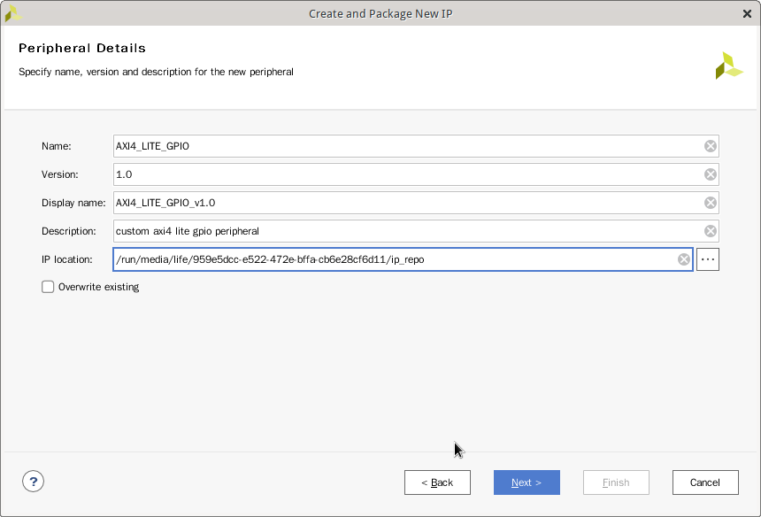
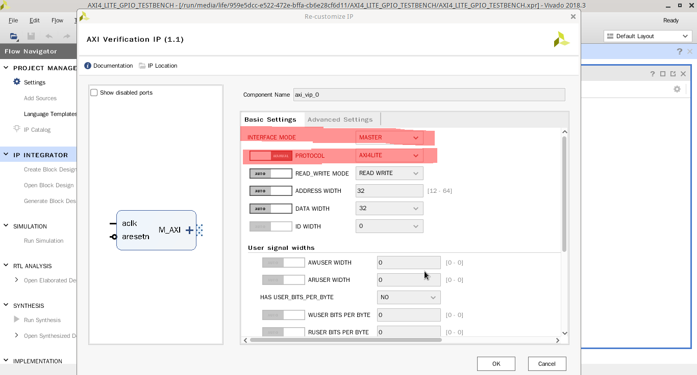

# 创建自定义IP

## 新建IP工程
打开在第一节中创建的工程，然后在菜单栏找到 Tools-> Create and Package New IP ...


然后进入IP创建向导


点击Next


然后在这里选择创建 AXI4 外设



然后填入新IP的名称，描述等信息。**注意IP名称中不要包含除下划线之外的特殊字符**，否则后面的步骤会出错。


在这个页面选择AXI总线接口名称，类型及模式。名称可以保持默认名称，Interface Type选Lite，Interface Mode选Slave。


最后在这个界面点击Finish完成添加新IP。

## 编辑新添加的IP


在主界面的左侧点击 IP Catalog，然后在右侧会出现所有可用的IP，然后最上面就是刚才创建的新IP。


然后右键选择邮件菜单中的 __Edit in IP packager__ 。然后会弹出一个对话框，点击OK即可。


vivado会创建一个临时工程用于编辑新IP。


然后在中间源码树中双击 __AXI4_LITE_GPIO_v1_0_S00_AXI_inst__，然后会打开verilog源码文件。然后在原来端口定义的最后一行新增一个输出端口。

```
...
		input  wire  S_AXI_RREADY,
        output wire [3:0] gpio_o
);

...
```
寄存器的定义在这个文件的104行：

```
...

	//----------------------------------------------
	//-- Signals for user logic register space example
	//------------------------------------------------
	//-- Number of Slave Registers 4
	reg [C_S_AXI_DATA_WIDTH-1:0]	slv_reg0;
	reg [C_S_AXI_DATA_WIDTH-1:0]	slv_reg1;
	reg [C_S_AXI_DATA_WIDTH-1:0]	slv_reg2;
	reg [C_S_AXI_DATA_WIDTH-1:0]	slv_reg3;

...
```
在这个文件的结尾处新增一段代码用于将寄存器和刚添加的gpio_o输出端口连起来。

```
...

	// Add user logic here
    assign gpio_o[3:0] = slv_reg0[3:0];
	// User logic ends

endmodule
```
然后还需要修改 AXI4_LITE_GPIO_v1_0 这个文件。和上面一样，双击打开文件，然后找到端口定义，添加

```
    input wire  s00_axi_rready , 
    output wire [3:0] gpio_o
);
```

然后在下面例化模块处加上

```
		.S_AXI_RREADY(s00_axi_rready),
		.gpio_o(gpio_o)
);
```

这样就把两个模块的 gpio_o 端口连起来了。然后保存，关闭编辑器。


然后在 __Package IP__ 标签页找到 __File Groups__ 栏，然后点击上方 __Merge changes from File Groups Wizard__。这会将刚才修改过的代码合并到IP中。


如果合并成功，File Groups 前面会出现一个绿色的小钩。


然后 __Customization Parameters__ 也点击上方的 __Merge changes from File Groups Wizard__ 。


最后在 __Review and Package__ 栏中点击 __Re-Package IP__ 完成新IP的编辑。

## 验证新IP

现在已经创建了一个新IP，但是还不知道这个新IP能否正常工作，所以需要编写一个测试工程来验证新IP是否能正常工作。这个IP的功能是将reg0的低四位输出到gpio_o端口上。例如reg0中的内容是0x12345678，gpio_o就应该输出0x8。

创建测试工程的方法和第一节一样。


创建工程之后会发现 __IP Catalog__ 中没有刚才新建的IP，所有需要手动添加。单击右键，在右键菜单中选择 __Add repository...__ 。


然后在弹出的对话框中选择 __ip_repo__ 文件夹的路径。 


添加完成之后在 IP Catalog 标签页会出现前面新建的IP。


在左侧工具栏中点击 __Create Block Design__ 按钮新建一个 Block Design。然后点击 + 按钮添加IP，在搜索框中输入 vip 后双击 __AXI Verification IP__ 添加此IP。这个IP可以用来模拟 AXI Lite Master向我们新建的外设发送数据。



双击 AXI Verification IP 进入IP参数设置界面，然后 Interface Mode 选择 Master。Procotol 选择 AXI4LITE。然后点击OK完成参数修改。


然后点击 + 添加我们创建的IP


添加完成后如图所示。


然后在把对应的线连起来。


然后单击 gpio_o 端口，右键菜单中选择 __Make External__;单击 aclk 端口，右键菜单中选择 __Create Port__;单击 aresetn 端口，右键菜单中选择 __Create Port__ 。


然后为 Block Design 创建一个 HDL Wapper。


这时候会出现一个警告，说没有给外设分配地址。


单击 __Address Editor__ 标签，然后找到对应的外设，在右键菜单中选择
 __Assign Address__ 分配地址。


先选择中间导航栏中的 __sim_1__ 文件夹，然后再点击 + 按钮


然后弹出添加文件对话框，选择添加仿真文件，点击 Next 继续。


然后点击 + 按钮选择新建文件，然后弹出新建文件对话框，文件类型选择 __SystemVerilog__，点击 Ok 按钮完成添加。然后点击 Finish 完成添加文件。 这时会弹出一个 Define Module 对话框，点OK即可。

axi4_lite_gpio_tb.sv 文件内容如下:

```
`timescale 1ns / 1ps
//////////////////////////////////////////////////////////////////////////////////
// Company: 
// Engineer: 
// 
// Create Date: 2020/10/12 07:34:39
// Design Name: 
// Module Name: axi_test_tb
// Project Name: 
// Target Devices: 
// Tool Versions: 
// Description: 
// 
// Dependencies: 
// 
// Revision:
// Revision 0.01 - File Created
// Additional Comments:
// 
//////////////////////////////////////////////////////////////////////////////////
import axi_vip_pkg::*;
import design_1_axi_vip_0_0_pkg::*;


module axi_test_tb(

    );

bit [3:0] gpio;
bit aresetn  = 0;
bit aclk     = 0;
bit [31:0] wr_data;
bit [31:0] rd_data;
xil_axi_resp_t resp;
xil_axi_prot_t prot = 0;

always #5ns aclk = ~aclk;

design_1_wrapper DUT(
    .aclk(aclk),
    .aresetn(aresetn),
    .gpio_o_0(gpio)
);

design_1_axi_vip_0_0_mst_t master_agent;

initial begin

    master_agent = new("master vip agent", DUT.design_1_i.axi_vip_0.inst.IF);
    master_agent.start_master(); 

    #10ns aresetn = 1;
    
    for(int i = 0; i < 1000; i++) begin

        wr_data = $urandom;
        
        #20ns
        master_agent.AXI4LITE_WRITE_BURST(32'h00000000, prot, wr_data, resp);

        #20ns
        master_agent.AXI4LITE_READ_BURST(32'h00000000, prot, rd_data, resp);

        #20ns
        if(rd_data != wr_data) begin
            $display("data do not match, test failed!");
            break;
        end
        
        if(gpio != wr_data[3:0]) begin
            $display("gpio do not match, test failed!");
            break;
        end
    
    end
    
    $display("data match, test succeeded!");
    $finish;
end

endmodule
```


在运行仿真代码之前需要修改一下仿真设置，将最大仿真时间改长一些。


在左侧导航栏中的 __SIMULATION__ 中找到 __Run Simulation__ 然后点击 __Run Behavioral Simulation__ 运行仿真。


然后等待仿真完成，就可以点击上方的按钮缩放波形图，在下方的控制台中可以找到测试成功的输出。

## 集成新IP至工程中
首先打开第一节中创建的工程，打开 Block Design。双击ZYNQ图标，打开配置


确保 __Allow access to PS/SLCR registers__ 选项钩上，不然之后Linux 无法初始化PL部分时钟。


然后点击 + 按钮添加新IP。


然后点击上方的 __Run Connection Automation__，vivado会自动添加缺失的IP并自动连线。


最后还需要把自定义IP的GPIO部分导出来。保存 Block Design。然后在中间导航栏中找到 constraint.xdc 文件并打开。在文件结尾处添加以下内容用来约束自定义IP的端口

```
set_property IOSTANDARD LVCMOS33 [get_ports {gpio_o_0[3]}]
set_property IOSTANDARD LVCMOS33 [get_ports {gpio_o_0[1]}]
set_property IOSTANDARD LVCMOS33 [get_ports {gpio_o_0[2]}]
set_property IOSTANDARD LVCMOS33 [get_ports {gpio_o_0[0]}]
set_property PACKAGE_PIN K17 [get_ports {gpio_o_0[3]}]
set_property PACKAGE_PIN E19 [get_ports {gpio_o_0[2]}]
set_property PACKAGE_PIN W13 [get_ports {gpio_o_0[0]}]
set_property PACKAGE_PIN W14 [get_ports {gpio_o_0[1]}
```

接下来和第一节中的一样 Run Synthesis -> Run Implementation -> Generate Bitstream -> Export HardWare 完成硬件部分设计。